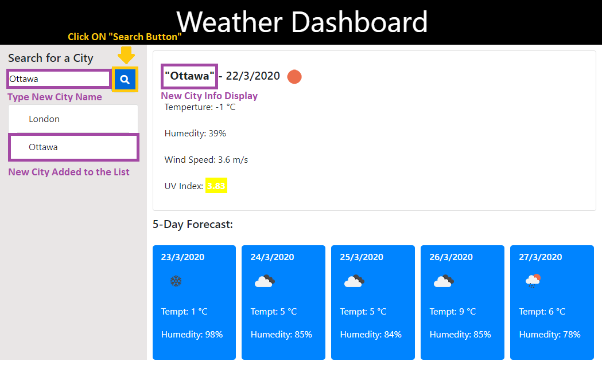

# homework6
Name

# "Server Side APIs, "Weather Dashboard".

# Instruction 
(Hold "Ctrl" key while you click on image "sample.png" to visualize)

  step 1

  

  - Open URL at the end of this ReadMe file, (recomended Browser: Google Chrome).

  step 2

    Application instructions:
    - Insert the name of the City in the input box.
    - Press on the "search button".
    - All the cities you search will be added to the "cities list".
    - You can reload the page and your "cities list" will be save.

  step 3

  

  - Insert City name and click on "Search Button" to Display 6 days weather info.

  step 4

  

  - Repeat same instructions as "step 3" and the new City will be added to your "Cities List".

  step 5

  

  - Now you can switch between all your cities in your List, just clicking on them to display "weather info".

# App Info Details

  

  - Current day info details.

  

  - 5 Days Forecast info details.

  

# Description

"Weather Dashboard" is an app that will help you to keep track of the weather around the world up to 6 Days in a row. This app will run in the browser and feature dynamically updated HTML and CSS powered by JavaScript plus the data from the API "open weather".

# Details

This repository content the html files: index "main page", the CSS styles "style.css", the JavaScript "script.js" and an "image" folder with the captures for this Readme File.

# URL 

The URL to open the page on your Browser is "https://diegolehyt.github.io/homework6/"